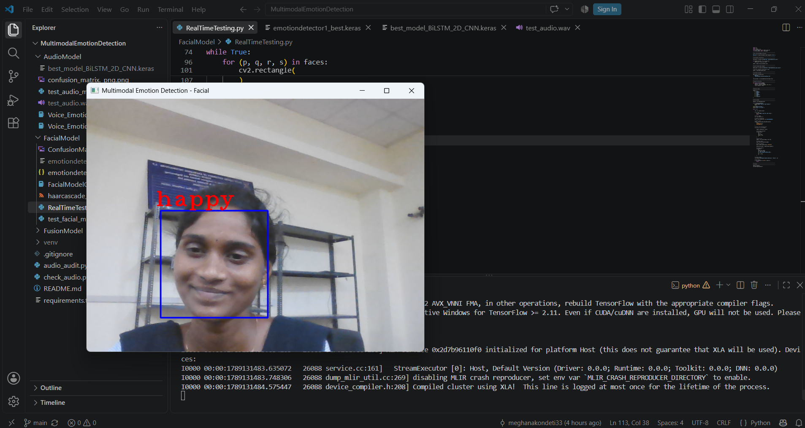
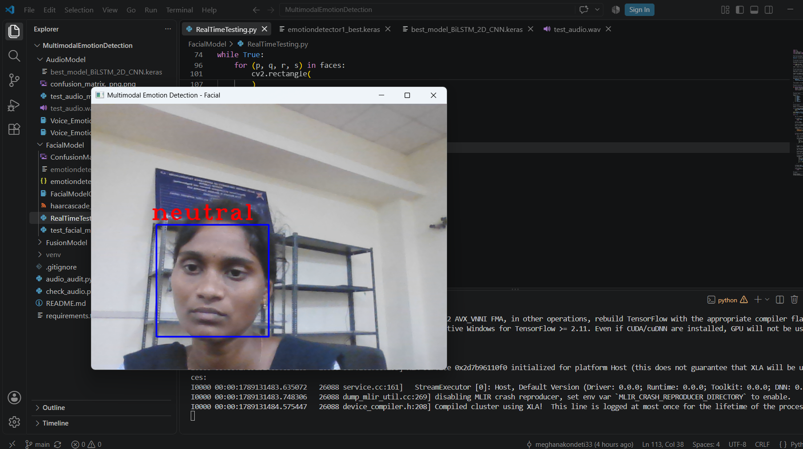
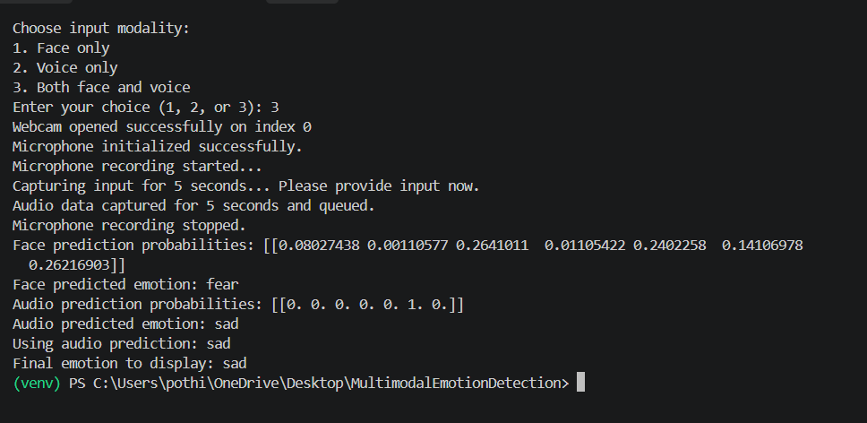

# Multi-Modal Emotion Detection

A deep-learning project for recognizing seven human emotions from facial images, speech, or both modalities together.

The project contains:

- A facial emotion classifier for grayscale `48 x 48` face images.
- An audio emotion classifier using MFCC features from five-second speech clips.
- A confidence-based fusion workflow that combines facial and audio predictions.
- Training notebooks, evaluation scripts, and sample image datasets.

## Supported emotions

`Angry` | `Disgust` | `Fear` | `Happy` | `Neutral` | `Sad` | `Surprise`

## 🎬 Demo

The system performs real-time emotion detection using facial expressions
and vocal features.

### Happy Emotion



### Neutral Emotion



---

## 📊 Example Output

The following screenshot shows an example prediction generated by the system.



## Repository structure

```text
.
├── AudioModel/
│   ├── best_model_BiLSTM_2D_CNN.keras
│   ├── test_audio_model.py
│   └── Voice_Emotion_Model.ipynb
├── FacialModel/
│   ├── emotiondetector1_best.keras
│   ├── test_facial_model.py
│   └── FacialModelCode.ipynb
├── FusionModel/
│   ├── fuse.py
│   └── offline_fusion_test.py
├── images/
│   ├── train/
│   ├── val/
│   └── test/
├── audio_audit.py
└── check_audio.py
```

Large datasets, generated outputs, audio files, NumPy artifacts, and model files are excluded by `.gitignore`. Make sure the required model files are present locally before running inference.

## Requirements

- Python 3.9 or newer
- A working webcam for face inference
- A working microphone for voice inference
- TensorFlow, OpenCV, Librosa, NumPy, PyAudio, and Tkinter

Create and activate a virtual environment, then install the Python dependencies:

```powershell
python -m venv .venv
.\.venv\Scripts\Activate.ps1
python -m pip install --upgrade pip
python -m pip install tensorflow opencv-python librosa numpy pyaudio
```

Tkinter is normally included with the standard Windows Python installation. If PyAudio does not install through `pip`, install a compatible PyAudio wheel for your Python version or use a package manager such as Conda.

## Running the project

Run commands from the repository root.

### Real-time face and voice inference

```powershell
python FusionModel\fuse.py
```

Choose one of the available modes when prompted:

1. Face only
2. Voice only
3. Face and voice

The application captures input for five seconds, prints the modality predictions, and displays the final emotion in a small GUI window.

### Facial model test

```powershell
python FacialModel\test_facial_model.py
```

This test uses the image configured by `IMAGE_PATH` in the script. Update that path to evaluate another image.

### Audio model test

```powershell
python AudioModel\test_audio_model.py
```

This test expects a five-second WAV file at `AudioModel\test_audio.wav`. Update `AUDIO_PATH` in the script if the sample is stored elsewhere.

### Offline fusion test

```powershell
python FusionModel\offline_fusion_test.py
```

This script loads the configured test image and WAV file, prints each modality's probability distribution, and applies the confidence-based fusion rule.

## How fusion works

When both modalities are available:

1. If the face confidence is more than `0.20` higher than the audio confidence, the face prediction is selected.
2. If the audio confidence is more than `0.20` higher, the audio prediction is selected.
3. Otherwise, the two probability vectors are averaged and the highest resulting probability is selected.

The real-time script also contains a small learned fusion model definition. The offline script currently uses the weighted probability average when the confidence values are close.

## Data and training

The notebooks contain the model training workflows. The `images/` directory is organized by split and emotion label. Audio dataset folders and large generated artifacts are intentionally ignored by Git; place them locally according to the paths used by the relevant notebook or script.

## Troubleshooting

- **Model not found:** confirm that both `.keras` files exist in `AudioModel/` and `FacialModel/`.
- **Camera not detected:** check camera permissions and close applications currently using the webcam.
- **Microphone not detected:** check microphone permissions and verify that PyAudio can access the input device.
- **No face captured:** use good lighting and position a face clearly inside the camera view.
- **Missing sample audio:** add a WAV file at `AudioModel/test_audio.wav` or change `AUDIO_PATH` in the test script.

## Status

This repository is an academic/prototype implementation for multimodal emotion recognition. Prediction quality depends on the training data, recording conditions, and the supplied model checkpoints.